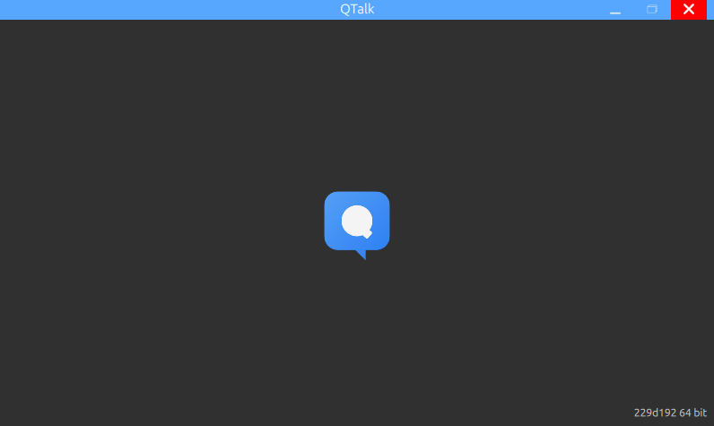
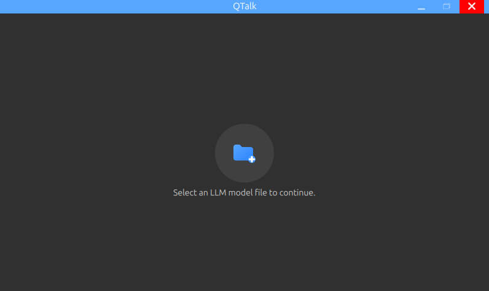
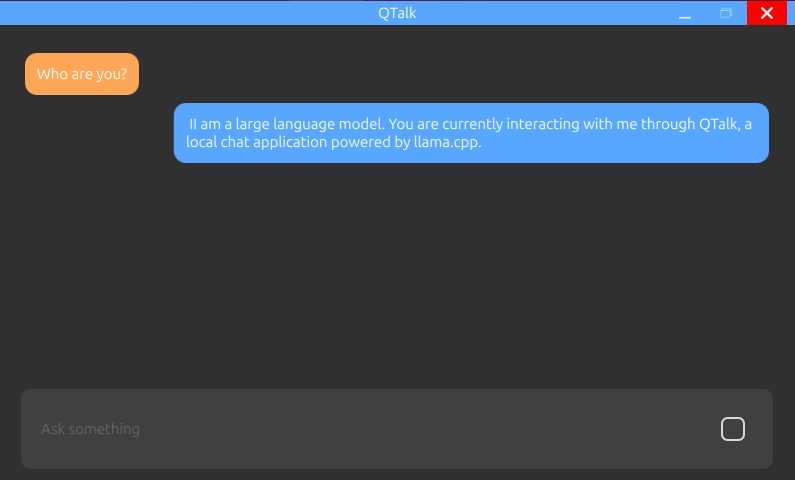

<p align="center">
  
</p>

QTalk is a simple AI chat application developed with Qt, running entirely locally (offline) by using the `llama.cpp` library.

Your data is always under your control. No internet connection or API key is required.

## 🎯 Current Features

The project is currently in an early stage of development. The current basic functions are:

* **Load Model:** You can select and load a GGUF format AI model file from your device.
* **Local Chat:** You can chat directly with the model you have loaded.
* **100% Offline:** All operations (model loading and chat) happen on your local machine without an internet connection.

## 📸 Screenshots

<p align="center">
  
  &nbsp;
  
  &nbsp;
  
</p>
<p align="center">
  <em>Splash Screen &nbsp;&nbsp;&nbsp;|&nbsp;&nbsp;&nbsp; Model Selection &nbsp;&nbsp;&nbsp;|&nbsp;&nbsp;&nbsp; Chat UI</em>
</p>

## 🛠️ Building from Source

To use the application, you currently need to build it from the source code.

### Prerequisites

* **Qt Framework:** Qt 6.8+
* **C++ Compiler:** A compiler supporting C++17 (e.g., GCC 13+)
* **CMake:** CMake 3.25+
* **Git**
* **Python 3:** (Required to run the optional model fetcher script)

### Build Steps

1.  **Clone the repository** (including submodules):
    ```bash
    git clone git@github.com:hyaldiz/QTalk.git
    cd QTalk
    ```

2.  **(Optional) Download a test model** using the helper script:
    ```bash
    python fetch_models.py
    ```

3.  **Configure and build the project** using CMake:
    * First, create a `build` directory and navigate into it.
    * Run `cmake` to configure the project. You may need to specify your Qt path using `CMAKE_PREFIX_PATH`.
    * Finally, run `cmake --build` to compile the application.

    ```bash
    # Create build directory and move into it
    mkdir build && cd build

    # Run CMake (adjust the path to your Qt version)
    cmake .. -DCMAKE_PREFIX_PATH=/path/to/your/Qt/version

    # Build the project
    cmake --build . -j$(nproc) --config Release

    # Run unit tests
    cmake --build . -j$(nproc) --target check
    ```

4.  **Run the application.**
    The compiled executable will be inside the `build` directory.

    # Run app
    ./QTalk

    # Run standalone unit test
    ./QTalk --unittest <UnitTestName>


## 🚀 Future Plans

This project is under active development. Planned next steps include:

* [ ] Saving and viewing chat history.
* [ ] An interface for adjusting model parameters.
* [ ] Creating pre-built releases for download.

## 🤝 Contributing

Although the project is very new, you are welcome to open Issues for bug reports or Pull Requests for improvements.

## 📄 License

This project is distributed under the **MIT License**. See the `LICENSE` file for more details.